# Influence-Guided Data Pruning

## Purpose

This project asks whether a data-attribution method can identify molecules that should be retained or removed when fitting a pooled molecular-property model.

It follows, but is deliberately separate from, `towards-global-models`. That earlier study asks whether public data help a local model when added. This study asks a conditional question: after a model has been trained on the full pooled dataset, does its attribution ranking predict the effect of removing groups of training molecules?

The project has two sequential phases. Phase 1 evaluates BoostIn for XGBoost models on the datasets already used in the prior data-transfer work. Phase 2 evaluates TracIn with a neural molecular model, preferably on a curated OpenADMET CYP setting if that dataset is ready; otherwise it repeats the comparison on the Phase 1 datasets.

## Scientific Questions

1. Does removing high- versus low-attribution molecules change target-domain predictive performance as BoostIn predicts?
2. Is the effect different for native target-programme molecules, external donor molecules, and a mixed pooled set?
3. Does attribution provide information beyond simple alternatives such as random removal, label level, source identity, or chemical similarity?
4. Under what conditions does pooling remain preferable to a local-only model after data pruning?

## Conceptual Design

The primary model is trained on a native target dataset together with all eligible donor data. Attribution is computed relative to a target-like loss surface, then batches of molecules are removed from the same pooled training set. Each pruned model is compared with the full pooled baseline on held-out target-domain chemistry.

```mermaid
flowchart LR
    accTitle: Conditional Attribution-Pruning Design
    accDescr: The study scores molecules in a full pooled model, removes ranked or control batches from that same model, and evaluates their effect on held-out target-domain chemistry.

    pooled[Full pooled training set] --> score[Score training molecules]
    score --> arms[Construct ranked and control removal batches]
    arms --> refit[Refit pruned pooled models]
    refit --> evaluate[Evaluate on target-like held-out chemistry]
    evaluate --> compare[Compare with full pooled and local-only models]
```

This makes the perturbation match BoostIn's conditional interpretation. It is distinct from selecting a donor subset to add to a local model, which remains a useful but separate data-selection problem.

## Project Phases

| Phase | Estimator and model | Primary datasets | Aim |
| :--- | :--- | :--- | :--- |
| 1 | BoostIn with XGBoost | ExpansionRx, Biogen, and Polaris | Establish whether conditional tree influence predicts the effect of batch pruning in the existing, audited setting. The code will support rotating any source into the target role. |
| 2 | TracIn with a neural molecular model | Curated OpenADMET CYP data if ready; otherwise the Phase 1 setting | Compare a gradient-based estimator with BoostIn and develop molecule-level neural influence explanations. |

Phase 2 begins only after the Phase 1 design and outputs have been reviewed. It should reuse the experimental logic where appropriate, not silently change the scientific question.

## Phase 1: BoostIn Study Scope

The first episode will focus on one well-understood endpoint and one target evaluation setting, with HLM clearance and ExpansionRx as the likely starting point. We will use the same Morgan fingerprint and XGBoost specification as the preceding data-transfer study. We will use batch removal rather than individual deletion because individual effects are expected to be smaller than the refit noise floor.

The initial removal arms will include the following, at fixed batch sizes of 25, 50, 100, and 150 molecules:

- High- and low-BoostIn-score batches from donor data.
- High- and low-score batches from native target training data.
- High- and low-score batches across the combined pool.
- Repeated random removals matched in size.
- Label/source-stratified control removals: source composition and within-source label quantile-bin composition are preserved, but exact continuous-label equality is not guaranteed. These test whether any apparent attribution effect is explained by label extremity or source identity.

The full pooled model is the primary baseline for deletion effects. A local-only model will be reported as a practical reference, not substituted for the deletion baseline.

## Evaluation Principles

Attribution and evaluation must use distinct target-like surfaces so that the policy is not selected and judged on the same molecules. For ExpansionRx, the official test set is ordered by temporally assigned molecule identifier. It will be split at the identifier midpoint: the earlier half is the attribution and policy-selection surface, while the later half is the evaluation surface. The latter is approximately 10% of the full dataset and remains the preferred trade-off between preserving pooled training data and maintaining a temporally later evaluation set.

When Biogen or Polaris is rotated into the target role, their available target test partition will be resplit into distinct selection and evaluation surfaces by whole Butina clusters. This prevents close analogues from falling into both roles. Exact split fractions will be recorded in configuration and selected to retain enough evaluation molecules and clusters for paired uncertainty estimates.

The ExpansionRx supplied test set has already informed prior exploration. Results using its halves must therefore be described as temporally ordered exploratory analyses, not as newly sealed prospective confirmation. A later independent evaluation surface will be needed for a genuinely untouched final assessment.

Every comparison will retain per-seed predictions and use paired evaluation-molecule cluster bootstrap intervals. Results will be reported as effects, paired bootstrap intervals, and random-draw distributions. We will not use a pre-specified practical-effect threshold or overemphasise p-values in this exploratory phase.

## Interpretation Rules

We will not assume that a surprising ranking is caused by label level, source offsets, or chemical coverage. Those are explicit hypotheses to test using diagnostics and stratified controls.

Evidence that BoostIn is useful requires more than a change after ranked deletion: its effects must be interpreted alongside random-draw and label/source-stratified control policies at the same removal size, their paired uncertainty intervals, and their random-draw distributions. Policy comparisons use the median of every recorded control draw, never a representative draw selected by its observed effect.

Results from removal and addition experiments will be interpreted separately:

| Experiment | Question Answered |
| :--- | :--- |
| Full-model pruning | Does conditional attribution identify molecules to retain or remove? |
| Local-plus-subset addition | Can a selected external subset improve a local model? |
| Donor-only or small-seed addition | Is a selected donor subset sufficient without substantial local data? |

## Analysis and Reproducibility

All data preparation, fitting, attribution, batch construction, prediction, and uncertainty calculations will be executed by versioned scripts driven by immutable configuration files. A completed run will write its raw inputs, manifests, attribution scores, batch memberships, per-seed predictions, metric and bootstrap tables, software versions, and run metadata to a self-contained result directory.

Marimo notebooks will be analysis and presentation layers only. They may read and visualise completed run artifacts, perform transparent secondary summaries, and generate figures, but they must not refit models, recompute attribution, or silently alter raw results.

## Phase 2: TracIn Direction

If the curated CYP dataset is ready, Phase 2 will use it together with the OpenADMET CYP challenge data. This creates a natural setting for asking which curated external observations transfer to each CYP endpoint. A multitask neural model is attractive here, but task-specific attribution targets, missing-label handling, source-level label diagnostics, and challenge-compatible evaluation must be specified before fitting models.

If the curated CYP dataset is not ready, Phase 2 will use the same HLM/ExpansionRx–Biogen–Polaris setting as Phase 1. This provides a direct estimator comparison: the attribution target, pruning arms, controls, and evaluation surface should be held as comparable as possible while replacing BoostIn with TracIn.

## Later Extensions

- Replicate the deletion study across endpoints and target programmes.
- Develop an interactive Marimo notebook showing molecule-level influence explanations, structural neighbourhoods, chemical-space embeddings, and precomputed pruning curves.
- Revisit assay harmonisation only after establishing whether attribution is useful under the current measurement definitions.

## Non-Goals for the First Episode

- Claiming prospective performance from data that have already informed study design.
- Treating an attribution score as a causal explanation without stratified controls.
- Building a hybrid BoostIn/active-learning policy before the individual estimators have been evaluated cleanly.
- Conflating assay harmonisation with data-attribution performance.
